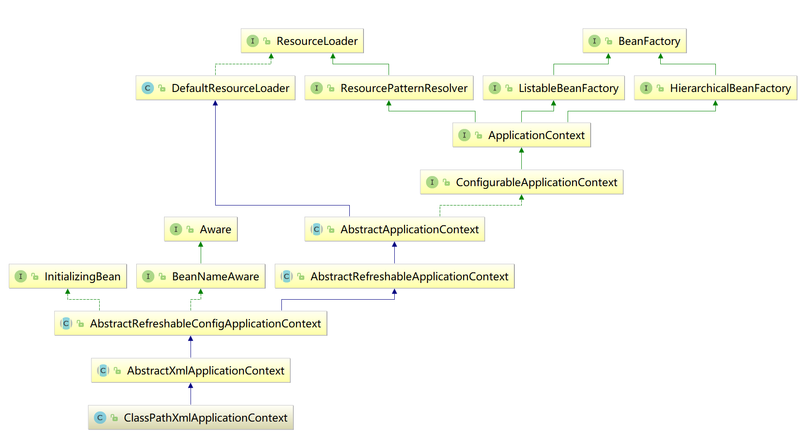

课题内容: 手写spring IOC容器/DI依赖注入/AOP动态代理
----

目录
==
* 课题要求
* 课题思路
* 
* spring ioc 原理 - BeanFactroy源码分析
* spring bean 创建和初始化
* spring bean 生命周期
* spring bean 延迟加载
* spring bean 依赖注入 DI
* ...
* spring aop 原理
* spring aop 基本实现 
* spring aop 
* 操作详细手册
----


课题要求
--
1. 写博客(每周一篇技术总结, 发链接到交流群. 两周不写视为放弃)
2. 写周报, 汇报进度和学习情况(两周不写视为放弃) 
3. 写简历.
4. 课题研究, 提出5个问题, 层层深入(模仿面试)
5. 提交资料(代码/文档/readme)
6. 结业感想
7. 个人照片

课题思路
--
1. 资料收集
2. 了解 Spring IOC/DI/AOP 基本原理
3. 简单实现一个 Spring IOC/DI/AOP maven java项目
4. 提出问题思路: 是什么/为什么/怎么工程实现/底层是如何实现/横向对比描述
5. 根据问题的主线, 逐步手动实现一个spring IOC/DI/AOP基本功能

Spring 框架
--
框架图: 


涉及模块: 
- 核心容器：核心容器提供 Spring 框架的基本功能。核心容器的主要组件是 BeanFactory，它是工厂模式的实现。BeanFactory 使用控制反转 （IOC） 模式将应用程序的配置和依赖性规范与实际的应用程序代码分开。
- Spring 上下文：Spring 上下文是一个配置文件，向 Spring 框架提供上下文信息。Spring 上下文包括企业服务，例如 JNDI、EJB、电子邮件、国际化、校验和调度功能。


spring ioc 原理 - BeanFactroy源码分析
--
1. 阅读BeanFactory.java源码


可知, beanFactory接口定义了getBean()方法, 获取"容器"中被管理的实例对象. 接下来, 关注一个重要的实现类DefaultListableBeanFactory.

2. 阅读DefaultListableBeanFactory.java源码


```
    //关注如下代码: 
    public class DefaultListableBeanFactory extends AbstractAutowireCapableBeanFactory
    		implements ConfigurableListableBeanFactory, BeanDefinitionRegistry, Serializable {

    /** Map of bean definition objects, keyed by bean name */
    private final Map<String, BeanDefinition> beanDefinitionMap = new ConcurrentHashMap<String, BeanDefinition>(256);
    
    //---------------------------------------------------------------------
    // Implementation of BeanDefinitionRegistry interface
    //---------------------------------------------------------------------
    @Override
    public BeanDefinition getBeanDefinition(String beanName) throws NoSuchBeanDefinitionException {...}

    @Override
    public void registerBeanDefinition(String beanName, BeanDefinition beanDefinition)
            throws BeanDefinitionStoreException {...}
            
    @Override
    public void removeBeanDefinition(String beanName) throws NoSuchBeanDefinitionException {...}
    
   } 
```

可知, bean实例对象的信息在"容器"中是通过hashMap 被管理的. "容器"-beanFactory需要对这个bean实例对象进行注册等操作.

3. 单元测试beanFactory的初始化, 断点debug调试, 分析具体执行过程:

classPathXmlApplicationContext.java 继承图: 


3.1 AbstractApplicationContext.java 静态加载
```
    static {
            ContextClosedEvent.class.getName();
        }
```

3.2 ClassPathXmlApplicationContext.java 构造初始化
```
    public ClassPathXmlApplicationContext(String configLocation) throws BeansException {
            this(new String[]{configLocation}, true, (ApplicationContext)null); //step into ClassPathXmlApplicationContext(..)
        }
    public ClassPathXmlApplicationContext(String[] configLocations, boolean refresh, ApplicationContext parent) throws BeansException {
            super(parent);
            this.setConfigLocations(configLocations);        //step into 3.3
            if (refresh) {
                this.refresh();                              //step into 3.4
            }
    
        }
        
```

3.3 AbstractRefreshableConfigApplicationContext.java 配置文件的加载
```
    public void setConfigLocations(String... locations) {
            if (locations != null) {
                Assert.noNullElements(locations, "Config locations must not be null");
                this.configLocations = new String[locations.length];
    
                for(int i = 0; i < locations.length; ++i) {
                    this.configLocations[i] = this.resolvePath(locations[i]).trim(); //step into resolvePath(..)
                }
            } else {
                this.configLocations = null;
            }
        }
    protected String resolvePath(String path) {
            return this.getEnvironment().resolveRequiredPlaceholders(path); 
        }    
```

3.4 AbtractApplicationContext.java beanFactory的初始化过程
```
    public void refresh() throws BeansException, IllegalStateException {
        Object var1 = this.startupShutdownMonitor;
        synchronized(this.startupShutdownMonitor) {
            // Prepare this context for refreshing.
            prepareRefresh();

            // Tell the subclass to refresh the internal bean factory.
            ConfigurableListableBeanFactory beanFactory = obtainFreshBeanFactory(); //step into obtainFreshBeanFactory()

            // Prepare the bean factory for use in this context.
            prepareBeanFactory(beanFactory);

            try {
                // Allows post-processing of the bean factory in context subclasses.
                postProcessBeanFactory(beanFactory);  

                // Invoke factory processors registered as beans in the context.
                invokeBeanFactoryPostProcessors(beanFactory);

                // Register bean processors that intercept bean creation.
                registerBeanPostProcessors(beanFactory);

                // Initialize message source for this context.
                initMessageSource();

                // Initialize event multicaster for this context.
                initApplicationEventMulticaster();

                // Initialize other special beans in specific context subclasses.
                onRefresh();

                // Check for listener beans and register them.
                registerListeners();

                // Instantiate all remaining (non-lazy-init) singletons.
                finishBeanFactoryInitialization(beanFactory);

                // Last step: publish corresponding event.
                finishRefresh();
            }
        }
    }

    protected ConfigurableListableBeanFactory obtainFreshBeanFactory() {
        refreshBeanFactory();                                            // step into 3.4.1
        ConfigurableListableBeanFactory beanFactory = getBeanFactory();  // step into 3.4.2
        if (logger.isDebugEnabled()) {
            logger.debug("Bean factory for " + getDisplayName() + ": " + beanFactory);
        }
        return beanFactory;
    }
```

3.4.1 AbstractRefreshApplicationContext.java 初始化beanFactory实例
```
    protected final void refreshBeanFactory() throws BeansException {
        if (hasBeanFactory()) {                                            //保证容器只有一个
            destroyBeans();
            closeBeanFactory();
        }
        try {
            DefaultListableBeanFactory beanFactory = createBeanFactory();  //创建beanFactory
            beanFactory.setSerializationId(getId());                       //返回beanFactory前的初始化操作
            customizeBeanFactory(beanFactory);
            loadBeanDefinitions(beanFactory);                              //step into 4.1
            synchronized (this.beanFactoryMonitor) {                       //保证线程安全, 赋值
                this.beanFactory = beanFactory;
            }
        }
    }
```

3.4.2 AbstractRefreshApplicationContext.java 线程安全的情况下,获得beanFactory实例
``` 
    public final ConfigurableListableBeanFactory getBeanFactory() {
    		synchronized (this.beanFactoryMonitor) {
    			if (this.beanFactory == null) {
    				throw new IllegalStateException("BeanFactory not initialized or already closed - " +
    						"call 'refresh' before accessing beans via the ApplicationContext");
    			}
    			return this.beanFactory;
    		}
    	}
```

4.1 在返回beanFactory实例之前, 完成bean实例的加载, 实现了beanFactory的管理功能.(追踪beanDefination)

AbstractXmlApplicationContext.java
```
    protected void loadBeanDefinitions(DefaultListableBeanFactory beanFactory) throws BeansException, IOException {
        // Create a new XmlBeanDefinitionReader for the given BeanFactory.
        XmlBeanDefinitionReader beanDefinitionReader = new XmlBeanDefinitionReader(beanFactory); //step into 4.1.1

        // Configure the bean definition reader with this context's
        // resource loading environment.
        beanDefinitionReader.setEnvironment(this.getEnvironment());
        beanDefinitionReader.setResourceLoader(this);
        beanDefinitionReader.setEntityResolver(new ResourceEntityResolver(this));

        // Allow a subclass to provide custom initialization of the reader,
        // then proceed with actually loading the bean definitions.
        initBeanDefinitionReader(beanDefinitionReader);
        loadBeanDefinitions(beanDefinitionReader);                      //step into 4.2
    }
```
4.1.1 XmlBeanDefinitionReader.java 完成bean实例的注册
``` 
    public XmlBeanDefinitionReader(BeanDefinitionRegistry registry) {
    		super(registry); // step into AbstractBeanDefinitionReader(至此即可,不深究了)
    	}
```
4.2 AbstractXmlApplicationContext.java 


``` 
    protected void loadBeanDefinitions(XmlBeanDefinitionReader reader) throws BeansException, IOException {
        Resource[] configResources = getConfigResources(); 
        if (configResources != null) {
            reader.loadBeanDefinitions(configResources);
        }
        String[] configLocations = getConfigLocations();  //获取 3.3 加载的配置文件
        if (configLocations != null) {
            reader.loadBeanDefinitions(configLocations);  // step into 4.2.1
        }
    }
```

4.2.1 AbstractBeanDefinitionReader.java 
``` 
    public int loadBeanDefinitions(String... locations) throws BeanDefinitionStoreException {
        Assert.notNull(locations, "Location array must not be null");
        int counter = 0;
        for (String location : locations) {
            counter += loadBeanDefinitions(location); // step into next func
        }
        return counter;
    }
    
    public int loadBeanDefinitions(String location) throws BeanDefinitionStoreException {
        return loadBeanDefinitions(location, null); // step into 4.2.2
    }
```

4.2.2 XmlBeanDefinitionReader.java 
``` 
    public int loadBeanDefinitions(EncodedResource encodedResource) throws BeanDefinitionStoreException {
        Assert.notNull(encodedResource, "EncodedResource must not be null");
        if (logger.isInfoEnabled()) {
            logger.info("Loading XML bean definitions from " + encodedResource.getResource());
        }

        Set<EncodedResource> currentResources = this.resourcesCurrentlyBeingLoaded.get();
        if (currentResources == null) {
            currentResources = new HashSet<EncodedResource>(4);
            this.resourcesCurrentlyBeingLoaded.set(currentResources);
        }
        if (!currentResources.add(encodedResource)) {
            throw new BeanDefinitionStoreException(
                    "Detected cyclic loading of " + encodedResource + " - check your import definitions!");
        }
        try {
            InputStream inputStream = encodedResource.getResource().getInputStream();
            try {
                InputSource inputSource = new InputSource(inputStream);
                if (encodedResource.getEncoding() != null) {
                    inputSource.setEncoding(encodedResource.getEncoding());
                }
                return doLoadBeanDefinitions(inputSource, encodedResource.getResource());  // step into 4.2.3 (***重要***)
            }
            finally {
                inputStream.close();
            }
        }
        catch (IOException ex) {
            throw new BeanDefinitionStoreException(
                    "IOException parsing XML document from " + encodedResource.getResource(), ex);
        }
        finally {
            currentResources.remove(encodedResource);
            if (currentResources.isEmpty()) {
                this.resourcesCurrentlyBeingLoaded.remove();
            }
        }
    }
```

4.2.3 XmlBeanDefinitionReader.java 
``` 
    protected int doLoadBeanDefinitions(InputSource inputSource, Resource resource)
    			throws BeanDefinitionStoreException {
        try {
            Document doc = doLoadDocument(inputSource, resource); 
            return registerBeanDefinitions(doc, resource); //step into next func
        }
        ...
    }
    
    public int registerBeanDefinitions(Document doc, Resource resource) throws BeanDefinitionStoreException {
        BeanDefinitionDocumentReader documentReader = createBeanDefinitionDocumentReader();
        int countBefore = getRegistry().getBeanDefinitionCount();
        documentReader.registerBeanDefinitions(doc, createReaderContext(resource)); // step into next func
        return getRegistry().getBeanDefinitionCount() - countBefore;
    }  
    
    public XmlReaderContext createReaderContext(Resource resource) {
        return new XmlReaderContext(resource, this.problemReporter, this.eventListener,
                this.sourceExtractor, this, getNamespaceHandlerResolver());        // step into next func
    }
    
    step step step ...into 4.2.4
```

4.2.4 DefaultBeanDefinitionDocumentReader.java
``` 
    public void registerBeanDefinitions(Document doc, XmlReaderContext readerContext) {
        this.readerContext = readerContext;
        logger.debug("Loading bean definitions");
        Element root = doc.getDocumentElement();
        doRegisterBeanDefinitions(root);  // step into next func
    }
    
    protected void doRegisterBeanDefinitions(Element root) {
        // Any nested <beans> elements will cause recursion in this method. In
        // order to propagate and preserve <beans> default-* attributes correctly,
        // keep track of the current (parent) delegate, which may be null. Create
        // the new (child) delegate with a reference to the parent for fallback purposes,
        // then ultimately reset this.delegate back to its original (parent) reference.
        // this behavior emulates a stack of delegates without actually necessitating one.
        BeanDefinitionParserDelegate parent = this.delegate;
        this.delegate = createDelegate(getReaderContext(), root, parent);

        if (this.delegate.isDefaultNamespace(root)) {
            String profileSpec = root.getAttribute(PROFILE_ATTRIBUTE);
            if (StringUtils.hasText(profileSpec)) {
                String[] specifiedProfiles = StringUtils.tokenizeToStringArray(
                        profileSpec, BeanDefinitionParserDelegate.MULTI_VALUE_ATTRIBUTE_DELIMITERS);
                if (!getReaderContext().getEnvironment().acceptsProfiles(specifiedProfiles)) {
                    if (logger.isInfoEnabled()) {
                        logger.info("Skipped XML bean definition file due to specified profiles [" + profileSpec +
                                "] not matching: " + getReaderContext().getResource());
                    }
                    return;
                }
            }
        }

        preProcessXml(root);
        parseBeanDefinitions(root, this.delegate);   // step into next func
        postProcessXml(root);

        this.delegate = parent;
    }
    
    protected void parseBeanDefinitions(Element root, BeanDefinitionParserDelegate delegate) {
        if (delegate.isDefaultNamespace(root)) {
            NodeList nl = root.getChildNodes();
            for (int i = 0; i < nl.getLength(); i++) {
                Node node = nl.item(i);
                if (node instanceof Element) {
                    Element ele = (Element) node;
                    if (delegate.isDefaultNamespace(ele)) {
                        parseDefaultElement(ele, delegate);   // step into 4.2.5
                    }
                    else {
                        delegate.parseCustomElement(ele);
                    }
                }
            }
        }
        else {
            delegate.parseCustomElement(root);
        }
    }
```

4.2.5 DefaultBeanDefinitionDocumentReader.java 解析xml
``` 
    private void parseDefaultElement(Element ele, BeanDefinitionParserDelegate delegate) {
        if (delegate.nodeNameEquals(ele, IMPORT_ELEMENT)) {
            importBeanDefinitionResource(ele);
        }
        else if (delegate.nodeNameEquals(ele, ALIAS_ELEMENT)) {
            processAliasRegistration(ele);
        }
        else if (delegate.nodeNameEquals(ele, BEAN_ELEMENT)) {
            processBeanDefinition(ele, delegate);                  // step into next func
        }
        else if (delegate.nodeNameEquals(ele, NESTED_BEANS_ELEMENT)) {
            // recurse
            doRegisterBeanDefinitions(ele);
        }
    }
    
    protected void processBeanDefinition(Element ele, BeanDefinitionParserDelegate delegate) {
        BeanDefinitionHolder bdHolder = delegate.parseBeanDefinitionElement(ele);
        if (bdHolder != null) {
            bdHolder = delegate.decorateBeanDefinitionIfRequired(ele, bdHolder);
            try {
                // Register the final decorated instance.
                BeanDefinitionReaderUtils.registerBeanDefinition(bdHolder, getReaderContext().getRegistry());
            }
            catch (BeanDefinitionStoreException ex) {
                getReaderContext().error("Failed to register bean definition with name '" +
                        bdHolder.getBeanName() + "'", ele, ex);
            }
            // Send registration event.
            getReaderContext().fireComponentRegistered(new BeanComponentDefinition(bdHolder));
        }
    }
```

4.2.6 BeanDefinitionReaderUtils.java 完成注册以及别名注册
``` 
    public static void registerBeanDefinition(
    			BeanDefinitionHolder definitionHolder, BeanDefinitionRegistry registry)
    			throws BeanDefinitionStoreException {

        // Register bean definition under primary name.
        String beanName = definitionHolder.getBeanName();
        registry.registerBeanDefinition(beanName, definitionHolder.getBeanDefinition());

        // Register aliases for bean name, if any.
        String[] aliases = definitionHolder.getAliases();
        if (aliases != null) {
            for (String alias : aliases) {
                registry.registerAlias(beanName, alias);
            }
        }
    }
```

BeanFactory的初始化分析:(大致如此, 个人不是特别详细)
1. "容器"实现BeanFactory接口定义的getBean()方法, 获取"容器"中被管理的实例对象;
2. "容器"继承DefaultListableBeanFactory类的beanDefinitionMap集合管理bean实例对象的信息; 实现BeanDefinitionRegistry接口的相关方法完成注册等操作;
3. "容器"静态加载一些操作;
4. "容器"构造初始化时, 完成配置文件的加载 和 完成内部bean factory的refresh()操作后, 返回beanFactory实例;
bean factory的refresh() 分两步走: 
4.1 保证容器只有一个的前提下, 完成 创建beanFactory, 初始化beanFactory(加载或注册配置文件中的bean实例*), 保证线程安全的前提下, 赋值;
4.1.1 通过XmlBeanDefinitionReader对象, 加载beanDefinition;
4.1.2 加载beanDefinition时, 通过DefaultBeanDefinitionDocumentReader对象, 解析xml;
4.1.3 通过BeanDefinitionReaderUtils对象, 完成注册;
4.2 保证线程安全的前提下, 获取beanFactory实例.

设计接口和实现类:
1. TinyBeanFactory接口类
- Object getBean(String name)
- <T> T getBean(String name, Class<T> c)
- boolean isSingleton(String name)
- boolean isPrototype(String name)
2. TinyResourceLoader接口类
- Resource getResource(String path);
- ClassLoader getClassLoader();
3. TinyDefaultResourceLoader实现类
- ClassLoader classLoader
- getResource()
4. TinyDefaultBeanFactory实现类
- private final Map<String, BeanDefinition> beanDefinitionMap = new ConcurrentHashMap<String, BeanDefinition>(256);
- getBean()
- Resource[] getConfigResources()
- initBeanDefinitionReader(XmlBeanDefinitionReader reader)
- loadBeanDefinitions(XmlBeanDefinitionReader reader)
5. TinyXmlBeanDefinitionReader实现类
6. TinyBeanDefinition实现类

